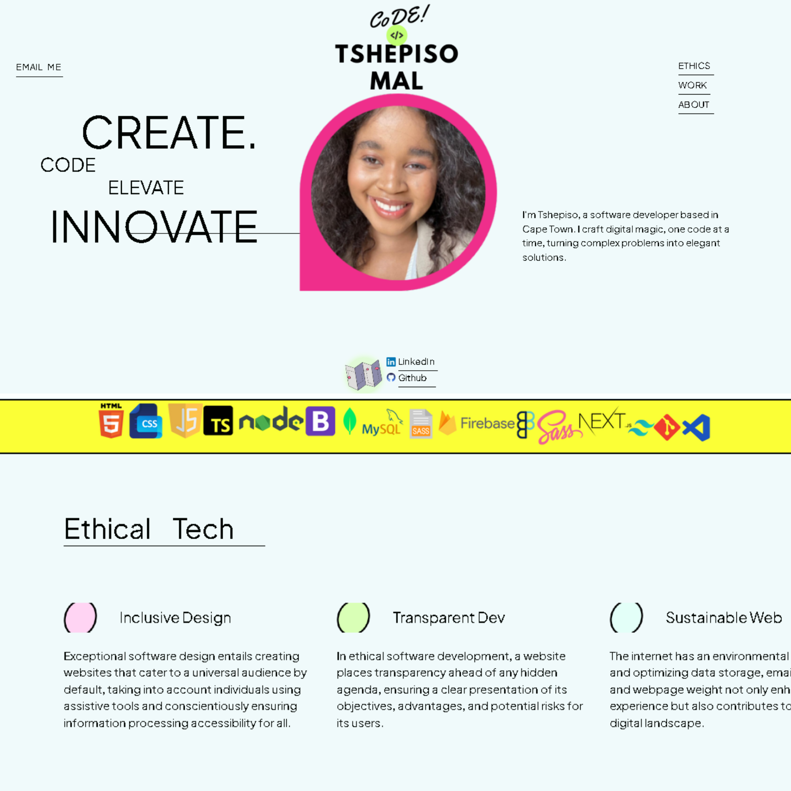

# PersonalPortfolio

PersonalPortfolio is a fully responsive personal portfolio website, responsive for all devices, built using HTML and CSS.

## Demo

 

 &nbsp;
 &nbsp;

## Built With

My personal portfolio <a href="https://maltsh.github.io/PersonalPortfolio/" target="_blank">PersonalPortfolio</a> which features some of my github projects as well as my resume and technical skills. 

This project was built using these technologies.

- CSS
- HTML

## Features

**📖 Multi-Page Layout**

**🎨 Styled with React-Bootstrap and Css with easy to customize colors**

**📱 Fully Responsive**

## Usage Instructions

Open the project folder and Navigate to `/src/components/`.  
You will find all the components used and you can edit your information accordingly.

## License

MIT

### Show your support

Give a ⭐ if you like this website!

